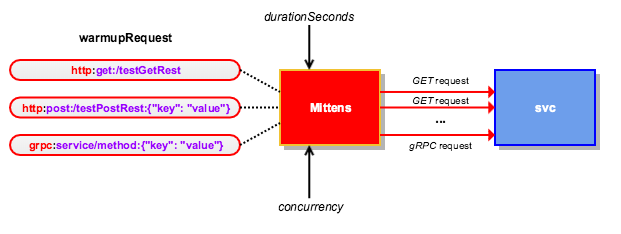

<h1 align="left">
  
</h1>

# Mittens
Mittens is a -command line- tool that can be used as a warm-up routine against an http application over HTTP (REST) or/and gRPC.

## Design
The application receives a number of command line arguments including the requests that will be sent to warm up the main service. Depending on the format of the requests this will invoke REST or/and gRPC calls.

An overview of the architecture is shown below:



This can also run as a linked container, or even as a sidecar in Kubernetes.

## Required arguments

| Argument                        | Default value   | Description                                                                                                                                                                                            |
|:--------------------------------|:----------------|:-------------------------------------------------------------------------------------------------------------------------------------------------------------------------------------------------------|
| readinessPath                   | /ready          | Path used as an http readiness probe; we consider the main app to be ready when a GET request to this path returns a 200 http status code.                                                             |
| timeoutForReadinessProbeSeconds | durationSeconds | How long we should wait for the readiness probe before running Mittens (time in seconds). When missing it waits for "durationSeconds".                                                                 |
| durationSeconds                 | 60              | Duration of the warmup routine. If "timeoutForReadinessProbeSeconds" is set this is the duration of the warmup step only. If "timeoutForReadinessProbeSeconds" is not set, this is the total duration. |
| httpTimeoutSeconds              | 10              | Timeout for the http client (for both readiness checks and for the actual warmup routine).                                                                                                             |
| concurrency                     | 2               | Number of concurrent requests during the warmup routine.                                                                                                                                               |
| httpHeader                      | N/A             | Http headers to be sent during the warmup routine. Format: "Header=Value".                                                                                                                             |
| grpcHeader                      | N/A             | Grpc headers to be sent during the warmup routine. Format: "Header:Value".                                                                                                                             |
| warmupRequest                   | N/A             | Request to be used during the warmup routine. See the subsection below on how to format your request.                                                                                                  |
| targetProtocol                  | http            | Protocol for target server. Possible values are http (default) or https.                                                                                                                               |
| targetHost                      | localhost       | The target server.                                                                                                                                                                                     |
| targetHttpPort                  | 8080            | Port for target http server.                                                                                                                                                                           |
| targetGrpcPort                  | 50051           | Port for target grpc server.                                                                                                                                                                           |
| requestDelayMilliseconds        | 0               | Adds a delay between requests.                                                                                                                                                                         |

### Warmup request format
A warmup request can be an HTTP one (over REST) or a gRPC one.

#### HTTP (REST) requests
HTTP requests are in the form `http:method:url:body` where `method` is one of `get`, `post`, or `put`, `url` is the url where the request will be sent, and `body` is a properly escaped JSON-formatted string.

Indicative examples are shown below:
- `http:get:/health`: HTTP GET request.
- `http:post:/warmupUrl:{"key":"value"}`: POST request with its url being `/warmupUrl` and its body being `{"key":"value"}`.
- `http:put:/warmupUrl:{"key":"value"}`: PUT request with its url being `/warmupUrl` its body being `{"key":"value"}`.

#### gRPC requests
gRPC requests are in the form `grpc:service/method:message` where `service` and `method` are the names of the gRPC service and method respectively, and `message` is a properly escaped JSON-formatted string.

_Note_: For both HTTP and gRPC requests you can use {today} and {today+n} to obtain the date for today or today +/- n days in YYYY-MM-DD format. For HTTP requests the date templating works for both URLs and body.

## How to build and run
Mittens is written in Go and the simplest way to run it is as a cmd application. It receives a number of command line arguments (also see "Required arguments") including the requests that will be sent to warm up the main service. Depending on the format of the requests this will invoke REST or/and gRPC calls.

The project uses [Go Modules](https://github.com/golang/go/wiki/Modules). 
We provide a [Makefile](Makefile) which can be used to generate an executable binary and a Dockerfile if you prefer to run using Docker.

### Binary
#### Build binary executable

To build the project run the following:
    
    make build

This will generate a binary executable.

#### Run tests

To run the tests:

    make test
    
#### Run the executable

To run the binary:
        
    ./mittens -readinessPath=/ready -durationSeconds=60 -httpTimeoutSeconds=15 -concurrency=3 -httpHeader=X-Forwarded-Proto=https -warmupRequest=http:get:/hotel/potatoes -warmupRequest=http:get:/hotel/tomatoes -warmupRequest="http:post:/hotel/aubergines:{\"foo\":\"bar\"}" -warmupRequest="grpc:service/method:{\"foo\":\"bar\"}" -requestDelayMilliseconds=10

### Docker
#### Build image

To build a Docker image named `mittens`:

    make docker

#### Run container

To run the container:

    docker run mittens:latest -readinessPath=/ready -durationSeconds=60 -httpTimeoutSeconds=15 -concurrency=3 -httpHeader=X-Forwarded-Proto=https -warmupRequest=http:get:/hotel/potatoes -warmupRequest=http:get:/hotel/tomatoes -warmupRequest="http:post:/hotel/aubergines:{\"foo\":\"bar\"}" -warmupRequest="grpc:service/method:{\"foo\": \"bar\"}"

_Note_: If you use Docker for Mac you might need to set `targetHost` to `docker.for.mac.localhost`, or `docker.for.mac.host.internal`, or `host.docker.internal` (depending on your version of Docker) so that your container can resolve localhost.

### Kubernetes deployment (as a sidecar)

```yaml
# for versions after 1.9.0 you can use apps/v1
# for versions before 1.6.0 use extensions/v1beta1
apiVersion: apps/v1beta1
kind: Deployment
metadata:
  name: mittens
spec:
  replicas: 1
  template:
    metadata:
      labels:
        app: mittens
    spec:
      containers:
      # primary container goes here
      # - name: foo
      #   image: lorem/ipsum:1.0
      # side car follows
      - name: mittens
        image: mittens:latest
        resources:
          limits:
            memory: 40Mi
            cpu: 20m
          requests:
            memory: 40Mi
            cpu: 20m
        readinessProbe: 
            exec:
              command:
              - cat
              - ready
            initialDelaySeconds: 10
            periodSeconds: 30
        livenessProbe: 
            exec:
              command:
              - cat
              - alive
            initialDelaySeconds: 10
            periodSeconds: 30
        args: 
        - "-concurrency"
        - "2"
        - "-durationSeconds"
        - "120"
        - "-readinessPath"
        - "/ready"
        - "-warmupRequest"
        - "http:get:/tomatoes/"
        - "-warmupRequest"
        - "http:get:/potatoes"
        - "-warmupRequest"
        - "http:post:/hotel/aubergines:{\"foo\":\"bar\"}
        - "-warmupRequest"
        - "grpc:service/method:{\"foo\":\"bar\"}
        - "-httpHeader"
        - "X-Forwarded-Proto=https"
```

### Notes about warmup duration

Be aware that setting **timeoutForReadinessProbeSeconds** will change how long the warmup routine will run for.

#### Option 1: setting just durationSeconds

```
readinessPath: /ready
durationSeconds: 90
warmupRequest: someRequest
warmupRequest: anotherRequest
```

With these configs the mittens container will start to call _/ready_.
Let's say that your application takes 30 seconds to start (ie, for _/ready_ to start returning 200).
What happens is that after these initial 30 seconds, mittens will start but it will only run for 60 seconds. This is because we already spent 30 seconds waiting for the app to start.
Note that during the warmup _someRequest_ and _anotherRequest_ will be called randomly and not in any particular order.

If the application is not ready after 90 seconds, we skip the warmup routine.

#### Option 2: setting durationSeconds and timeoutForReadinessProbeSeconds

```
readinessPath: /ready
durationSeconds: 90
timeoutForReadinessProbeSeconds: 60
warmupRequest: someRequest
warmupRequest: anotherRequest
```

With these configs the mittens container will start to call _/ready_.
Let's say that your application takes 30 seconds to start (ie, for _/ready_ to start returning 200).
What happens is that after these initial 30 seconds, the warmup will start but unlike the previous example, this time it will run for a full 90 seconds.
Note that during the warmup _someRequest_ and _anotherRequest_ will be called randomly and not in any particular order.

If the application is not ready after the defined 60 seconds, we skip the warmup routine.

## References
* [Mittens at Docker Hub](https://hub.docker.com/r/expediagroup/mittens/)

## Legal

This project is available under the [Apache 2.0 License](http://www.apache.org/licenses/LICENSE-2.0.html).

Copyright 2019 Expedia, Inc.
